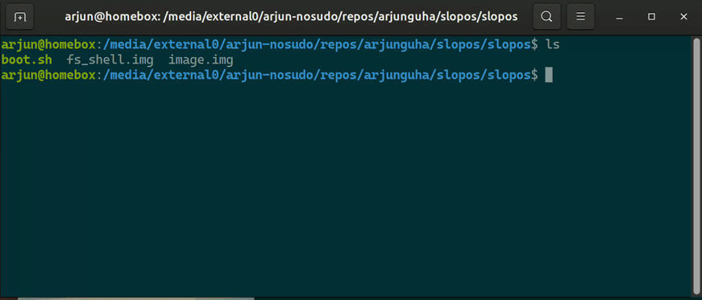

# SlopOS



## Introduction

We now have two examples of agent-written web browsers. I don't think I'm
skilled enough to guide an agent through writing a web browser, so I thought
I'd try something easier. Here is SlopOS, an operating system written by
GPT Codex 5.2 Medium, with some light guidance from me.

SlopOS is a glimpse of the future of operating systems. It leapfrogs the
ossified POSIX standard and C programming language. It goes beyond today's
timid attempts to use Rust in the kernel. Instead, SlopOS has a fully managed
userland and a (mostly) managed kernel. The secret ingredient is that it's written
in a modern, memory-safe, and latently-typed programming language: Scheme.

SlopOS has a tiny C kernel that embeds a Scheme interpreter with a
mark-and-sweep garbage collector running in ring 0. The C kernel exposes several
low-level primitives to Scheme for I/O, and starting new interpreter instances.
After the usual initialization, it loads the file boot.scm from the disk image.
This file has the bulk of kernel code, such as the file system implementation in
Scheme.

A highlight of SlopOS is its advanced, object-capability based security model.
Instead of the usual `eval` function from Scheme, SlopOS has an `eval-scoped`
function that restricts the set of primitive functions available to the callee.
You can see this in action in fs.scm, which explicitly lists every primitive
function that is available to userland. You can think of this as containers 2.0:
we don't need containers, and this makes the world a better place. Trust me, I
was there before containers.

SlopOS has some other unusual features:

1. It does not support networking yet. This could be considered a feature
   for safety-critical systems.

2. It currently requires programs to explicitly yield. This is similar to
   Windows 3.1, which was a great operating system. I've heard this is how
   some real-time operating systems work, but I don't really know anything about
   those.

3. The SlopOS filesystem optimizes the layout of files on disk to optimize
   seek times. No matter how large the file, SlopOS optimizes it to be stored as
   contiguous blocks. However, this means that you need to periodically, perhaps
   frequently, defragment the disk.

4. The SlopOS filesystem does not support directories. Instead, all files are in
   a single top-level directory. But organizing files is for old people. Think
   of this as a modern, Gen-Z filesystem.

All things considered, SlopOS is the ideal platform to build
non-networked, real-time, safety-critical systems such as Battlestar
Galactica.

## How It Actually Went

In any good operating systems course, you build your own operating system.
Although I didn't formally study OS, I've always been interested in systems, and
I tried to remedy this by working through Tanenbaum's textbook. I don't remember
how far I got, but I distinctly recall struggling over the minutiae of the boot
loader, which was the first thing that Codex struggled with for several minutes.

Codex also spent a lot of time debugging the garbage collector, which is also
very familiar to me. I am not completely confident it is entirely correct. On
the last GC bug that it found, I think it worked it around it by restructuring
the program instead of truly fixing the bug. It also took some guidance from me,
and a lot of trial and error by Codex, to make the operating system testable.
You'll see that there are several different init scripts, most of which don't
start the shell, so that the agent can get appropriate feedback from inscrutible
bugs Finally, Codex wrote itself a little Python script to check that it had
properly balanced parentheses in Scheme code. It used it several times to check
the Scheme that it wrote, which I found hilarious.

There are lots of ways to push this further. The C kernel is not as minimal as
it should be. For example, we shouldn't need C to implement cooperative
multitasking. I suspect the Scheme interpreter doesn't do proper tail calls,
which is embaressing. It certainly doesn't do bignums, but I've cared about
those. I'm confident that any frontier model could do all of these, and much
more, if asked to do the right thing.

I get a lot of leverage out of Cursor, Claude Code, and Codex in both teaching
and research. But SlopOS is something different—a peculiar form of creative
coding where I'm happy to let the model make decisions I don't review. That's
fun for a toy OS. It's not how I'd build anything that matters. At least, not
yet.


**The rest of the README is whatever the model generated for itself.**

A small 32-bit OS built around a Scheme kernel. It boots via BIOS/MBR with a
two-stage loader, switches to protected mode, and runs a freestanding C kernel
that hosts a compact R5RS-ish Scheme interpreter. Most kernel logic lives in
Scheme, including a flat filesystem and a simple interactive shell.

## Packages (Ubuntu)

You said you already have `build-essential`. Install the rest with:

```bash
sudo apt-get update
sudo apt-get install -y nasm binutils make qemu-system-x86
```

## Cross compiler

Install a freestanding `i386-elf-gcc` toolchain (no sudo required):

```bash
./scripts/install_i386_elf_toolchain.sh
```

Then add it to your PATH:

```bash
export PATH="$HOME/opt/cross/bin:$PATH"
```

## Build

```bash
make
```

This produces:

- `build/stage1.bin` (512-byte boot sector)
- `build/stage2.bin` (second-stage loader)
- `build/kernel.bin` (freestanding 32-bit kernel image)
- `build/fs.img` (boot script + flat filesystem image with Scheme programs)
- `build/os.img` (1.44MB floppy image with both stages + kernel)

## Run

```bash
make run
```

To run a specific init program by name (e.g., `init_scripts/alt.scm`):

```bash
make run-init NAME=alt
```

To build images for every init script:

```bash
make images
```

The default run prints a simple boot banner and then executes the selected
Scheme init program. QEMU powers off automatically when the Scheme runtime
finishes.

To run the shell init directly:

```bash
make run-init NAME=shell
```

To build a shell image and print the QEMU command:

```bash
./make-slopos.sh out_dir
```

The shell supports `ls`, `cat <file>`, `exec <file>`, and `create <file>`
(terminate file input by typing `EOF` on its own line), plus `help`.
`programs/` includes a sample `factorial.scm` you can run from the shell with
`exec factorial.scm`.

## Flat filesystem image

The packer builds a boot + filesystem image from `programs/`:

```bash
python3 scripts/mkfs.py programs build/fs.img
```

`boot.scm` is read from a fixed location at the start of the image. It defines
filesystem helpers (from `fs.scm`) and then loads `init.scm` from the flat
filesystem region.

## Init scripts

Init programs live in `init_scripts/`. The default image uses
`init_scripts/default.scm`. The shell lives in `init_scripts/shell.scm`.

### Boot + filesystem image layout

The `build/fs.img` format is:

- Offset 0x0000: `boot_len` (uint32 LE)
- Offset 0x0004: `fs_offset` (uint32 LE)
- Offset 0x0008: `boot.scm` bytes (length = `boot_len`)
- Offset `fs_offset`: superblock

Superblock (512 bytes at `fs_offset`):
- Magic: 8 bytes `SLOPFS1\0`
- Version: uint32 LE
- Dir offset (relative to `fs_offset`): uint32 LE
- Dir length (bytes): uint32 LE
- Data offset (relative to `fs_offset`): uint32 LE

Directory entries (packed, 76 bytes each):
- Name: 64 bytes ASCII, null-padded
- File offset (relative to `fs_offset`): uint32 LE
- File length (bytes): uint32 LE
- Reserved: uint32 LE (currently 0)

Notes:
- Filename length is limited to 64 ASCII bytes (longer names are rejected by the packer).
- `fs_offset` is aligned to 512 bytes; directory and data offsets are relative to `fs_offset`.

## Scheme interpreter (Linux)

Build and run the host test interpreter:

```bash
make scheme-host
./build/scheme-host
```

You can pass a Scheme file to run:

```bash
./build/scheme-host path/to/program.scm
```

To test disk-backed loading in the host interpreter, pass the filesystem image
as a second argument:

```bash
./build/scheme-host path/to/program.scm build/fs.img
```

## Tests

Run all tests:

```bash
uv run pytest -q
```

Run a single init script in QEMU (builds a fresh image each time):

```bash
./test.sh init_scripts/closure.scm
```

Shell tests use a Python harness that drives QEMU with scripted input.
